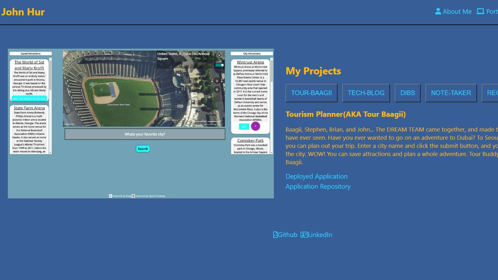

# John's Best React Portfolio

## Description

I made an updated version of my portfolio.

The application was made using react, so there will be some responsive functionality.

When certain a tags or buttons are clicked the image on the right hand side will change according what was clicked.

This portfolio highlights some of my abilities with some of the projects I've worked on.

There is a resume section where my resume is able to be downloaded.

There is a contact section as well. The form to message me is not working yet; however, I left my email and number for contact.

My portfolio is also mobile friendly!

Bonus points if you can find the easter egg.

Enjoy!

## Screenshots

## Links

GitHub Repository: [https://github.com/jhur628/the-best-react-portfolio](https://github.com/jhur628/the-best-react-portfolio)

Deployed Application: [https://jhur628.github.io/the-best-react-portfolio/](https://jhur628.github.io/the-best-react-portfolio/)

LinkedIn: [https://www.linkedin.com/in/john-hur-b146aa21a/](https://www.linkedin.com/in/john-hur-b146aa21a/)

Github: [https://github.com/jhur628](https://github.com/jhur628)

## Other Comments

As always, I had fun. I'm excited to do more, and I'm excited to see you tear my portfolio to pieces.

Thank you, and enjoy.